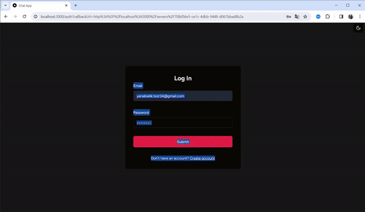

# Fullstack Next.js Chat app

## Description

I developed this project to strengthen my Next.js knowledge and recall key points of working with WebSockets. [Discord](https://discord.com/) was taken as design & features reference. 

**Main used technologies:**
- **Next.js 14** (Page router: chosen due to lack of Socket.io App Router support at the time of dev)
- **NextAuth** (Credentials authorization)
- **Prisma** (MySQL)
- **Socket.io** (WebSockets)
- **Zustand** (State management library)
- **shadcn/ui** (UI components)
- **TailwindCSS** (Styling)

## Demo

At this moment project isn't deployed to anywhere but here is demonstrative gif with my interactions with app
(speeded up)

## Key Features

- SignUp & SignIn with email & password
- Server creation and its customization
- Create text, audio and video call channels
- Member management (kick, change role)
- Invite users to server with generated link 
- Real-time messaging with sending images & emojis
- Delete & Edit messages in real time
- Message pagination & fetching on scroll 
- Websocket fallback: Polling every 1s
- Fully responsive UI
- Light / Dark mode switcher
- Error handling on client and server

## Setting up 

1. Step 1: Install all dependencies `npm i`
2. Step 2: Create .env file and add necessary variables (follow `env.example` file)
3. Step 3: Add DB and generate prisma schema `npx prisma generate`  & 
`npx prisma db push`
4. Start the app `npm run dev`
(next-env.d.ts should be generated automatically during build)

## TODO
- Chat update optimization: Now messages are sent using POST request. This function is implemented this way to provide socket fallback but it causes a little delay for message appearing in the chat area. So I'm planning to provide sending messages using WebSocket primarily.
- User avatar: I wanna add possibility to upload user profile photo during registration for better app appearance.